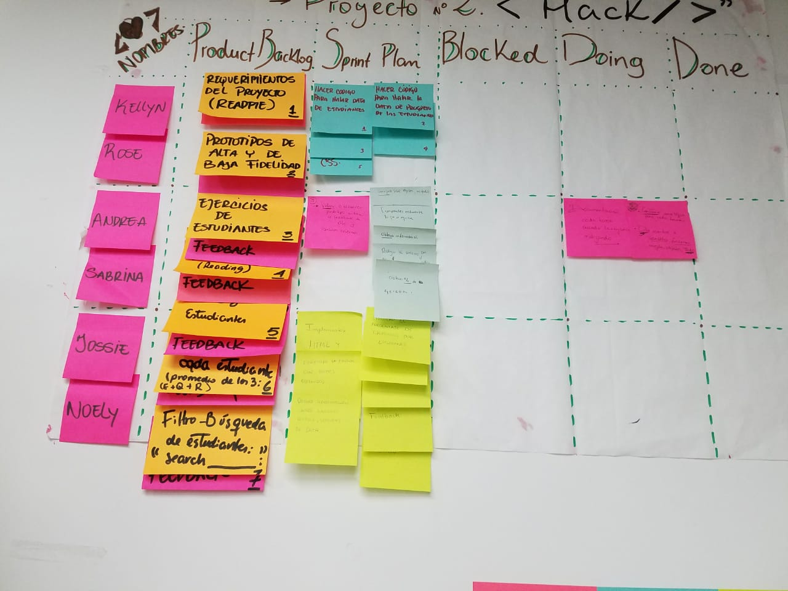
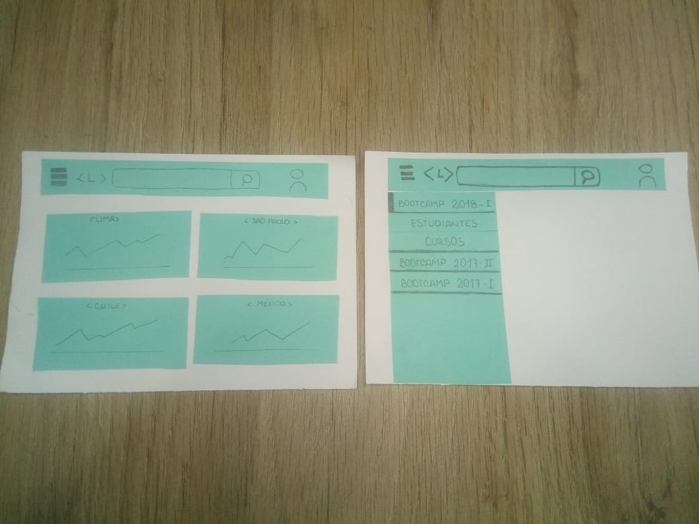
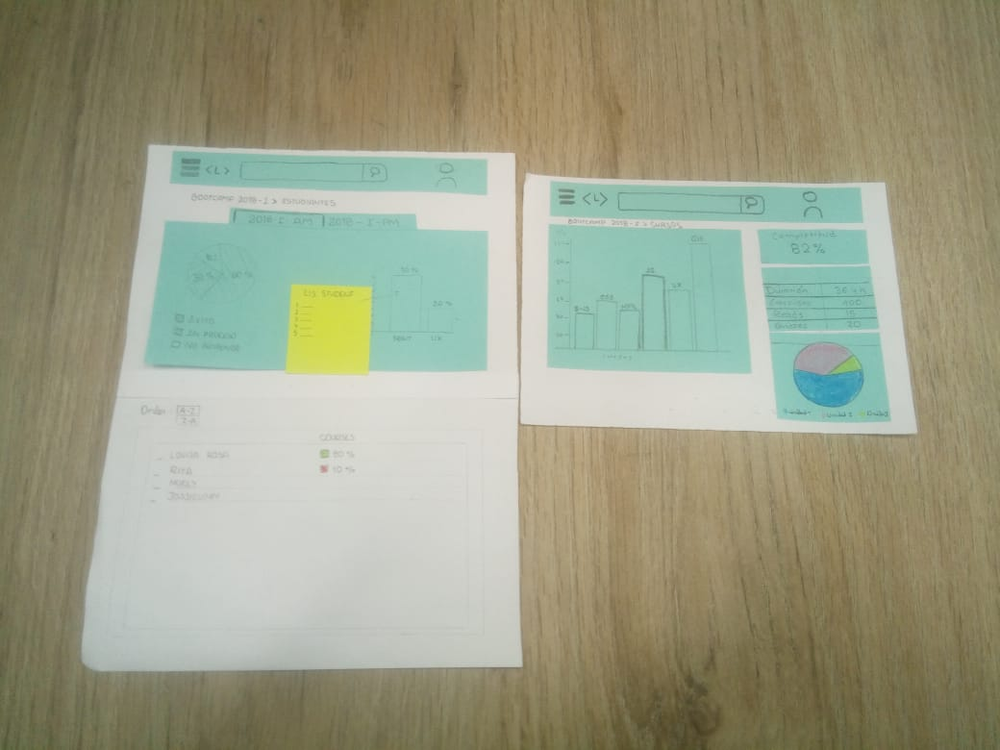
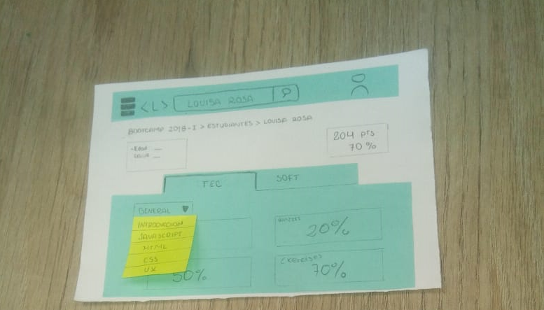
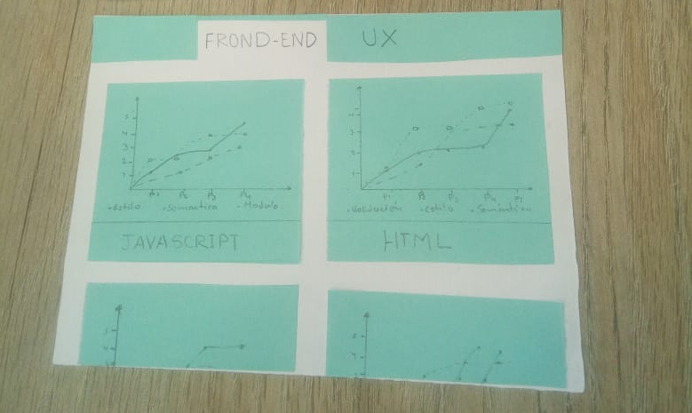
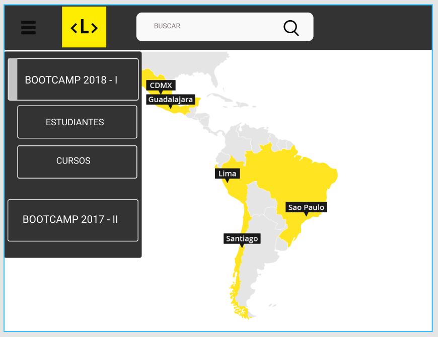
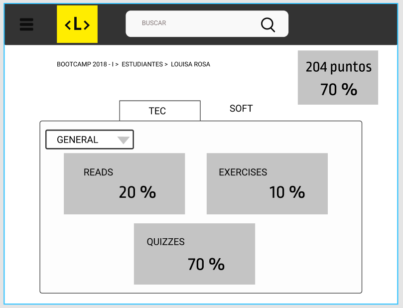

# Data Dashboard

## Preámbulo

En Laboratoria, las Training Managers (TMs) hacen un gran trabajo al analizar la
mayor cantidad de datos posibles respecto al progreso de las estudiantes para
apoyarlas en su aprendizaje.

La principal medida de progreso de una estudiante en Laboratoria es su avance
completando los proyectos de la [Ruta de Aprendizaje](https://docs.google.com/spreadsheets/d/1AoXQjZnZ5MTPwJPNEGDyvn5vksiOUoPr932TjAldTE4/edit#gid=536983970)
y su desempeño en función a la [Rúbrica de Niveles Esperados](https://docs.google.com/spreadsheets/d/e/2PACX-1vSkQy1waRpQ-16sn7VogiDTy-Fz5e7OSZSYUCiHC_bkLAKYewr4L8pWJ_BG210PeULe-TjLScNQQT_x/pubhtml).
Sin embargo, para completar estos proyectos las estudiantes acceden a contenidos
de aprendizaje (lecturas, videos, ejercicios y quizzes) en un sistema que
llamamos LMS (Learning Management System). El LMS acumula data sobre quién
leyó qué, qué ejercicios se han completado, los resultados de los quizzes, etc.

A pesar de que la data de progreso del LMS (ej. lecturas leídas, ejercicios
  completados, nota en quizzes, etc.) no impacta directamente en la evaluación
  de una estudiante, sí es una pieza de información relevante que las TMs
  quisieran visualizar para tener un mejor entendimiento de cómo va cada
  estudiante en su proceso de aprendizaje.

Así, el reto de este proyecto es crear una interfaz donde las TMs puedan
_ver_ y _usar_ la data de progreso del LMS. Para ello, proponemos crear un
**data dashboard** (_tablero de visualización de datos_).

## Introducción

Según un [estudio de IBM](https://www-01.ibm.com/common/ssi/cgi-bin/ssialias?htmlfid=WRL12345USEN),
el 90% de la data que existe hoy ha sido creada en los últimos dos años.
Cada día generamos 2.5 trillones de bytes de datos, una cifra sin precedentes.

Sin embargo, los datos por sí solos son de poca utilidad. Para transformar datos
en **información** necesitamos procesarlos y entenderlos. Una manera muy
sencilla de hacerlo es creando _visualizaciones_. Las
empresas líderes de hoy generan visualizaciones dinámicas de su data
que les permiten entender mejor su negocio y tomar decisiones apropiadas.

En este proyecto tendrás tu primer acercamiento a transformar data en
información creando tu primer **data dashboard**.

Si pensamos en un _dashboard_ podemos pensar en el tablero de control de un auto
o el de un avión. Un espacio desde el cual un usuario puede tener acceso a la
información y controles más relevantes, en este caso, del vehículo que está
utilizando. El _dashboard_ de un auto le permite a quien conduce saber a qué
velocidad está yendo, qué cambio/velocidad está utilizando, cuánto combustible
tiene disponible, cuál es la temperatura del motor, cuántas revoluciones por
minuto dan las ruedas, cuánta distancia ha recorrido, etc.

## Aplicaciones en el mundo real

En el mundo de la web es muy común el uso de _dashboards_. De hecho, [wikipedia](https://goo.gl/P7PF4y)
nos dice que un _dashboard_ puede ser un resumen gráfico de varias piezas de
información importante, generalmente utilizadas para dar una visión general de
una empresa o de un servicio. Así, tenemos dashboards como los de:

* [Google Analytics](https://assets.econsultancy.com/images/resized/0003/3813/mobile_commerce_dashboard-blog-full.png)
  para visualizar la data de tráfico de sitios web.

* [Mailchimp](https://blog.mailchimp.com/wp-content/uploads/2016/11/Dashboard-view-3-Copy-1008x768.jpg)
  para visualizar el desempeño de campañas de mercadeo digital por correo
  electrónico.

* [Quickbooks](https://quickbooks.intuit.com/content/dam/intuit/quickbooks/branding/make-organization-easy-visual.png)
  para visualizar la información financiera de una empresa.

Seguramente, a lo largo de tu carrera como diseñadora o desarrolladora, te
tocará crear un _data dashboard_. Quizás sea para visualizar la data de un
negocio de delivery de comida, o las rutas históricas de un negocio de
transporte, o simplemente los indicadores clave de tu propio emprendimiento ;)

## Sprint Planing

De acuerdo a lo planificado para este proyecto:

Dado este proyecto nos enfocamos directamente en la necesidad del usuario, que actualmente son las Training Managers (TMs) de Laboratoria.
Requerian de un acceso a informacion de forma rapida y consisa de datos por cada estudiante de Laboratoria, ver el el proceso de su avance por cada alumna sobre un cohort determinado ya seleccionado.
De acuerdo a los requerimientos presentados realizamos nuestro primer sketch(prototipo de baja fidelidad).

Una vez teniendo este sketch:
1. Se procedio a realizar entrevistas
2. Solicitamos feedback de parte del equipo de Laboratoria.

Donde obtuvimos la siguiente informacion:

* Donde los principales usuarios son: Training Managers de Laboratoria.

* El objetivo principal en relacion al producto:

  + Es el de acceder a datos globales para poder ver el rendimiento de cada alumna de Laboratoria de diferentes sedes.

* La informacion mas importante a visualizarse en la interfaz :

  + Datos globales de las promociones anteriores y actuales (Cohorts : mortar_board : ).
  + Progreso de cada Alumna en base a lecturas, examenes, ejercicios por promocion.

* Acceso a datos:
  + Se accede a estos datos a finales de cada proyecto presentado por las alumnas de Laboratoria.

Por ultimo nos acercamos a las usuarias directas Training Managers (TMs), para pulir detalles, donde presentamos el sketch de baja fidelidad, para hacer el testeo a las usuarias, nos indicaron detalles a reforzar.
De acuerdo al primer feedback realizamos  la Interfaz de Usuario.

De acuerdo al feedback constante por parte del equipo de Laboratoria y de las Training Managers (TMs), procedimos a diseñar la interfaz de acuerdo a los requerimientos del usuario a travez de la herramienta Figma.

Exactamente se visualiza todo el flujo del proyecto, donde se puede seleccionar un cohort de una lista de cohorts, a partir de ello se visualiza datos generales de las estudiantes de como van en todo el proceso de aprendizaje durante el Bootcamp sobre cada cohort y con mas a detalle al ingresar a visualizar informacion por cada alumna.
Optamos por hacer uso de solo tres colores en toda la interfaz.

### Implementación de la Interfaz de Usuario (HTML/CSS/JS)

Actualmente nuestra Interfaz de usuario nos permite:

1. Permitir al usuario seleccionar un cohort de una lista de cohorts.
2. Al seleccionar un cohort:
   - Listar las estudiantes de ese cohort
   - Para cada estudiante:
     + Calcular porcentaje de completitud de todos los _cursos_.
     + Calcular grado de completitud de _lecturas_, _ejercicios autocorregidos_,
       y _quizzes_.
   - Ordenar estudiantes por completitud _general_ (porcentaje consumido/completado
     de todos los cursos del cohort en cuestión), de _lecturas_, _ejercicios
     autocorregidos_ y _quizzes_.
   - Filtrar/buscar estudiantes por nombre.
3. Visualizarse a travez de distintos tamaños de pantallas: móviles,
   tablets y desktops (responsive);

