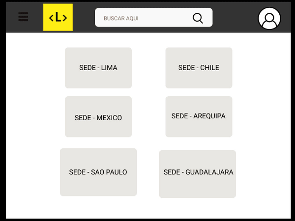
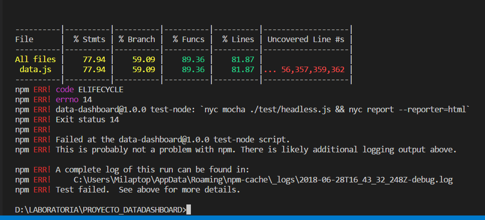
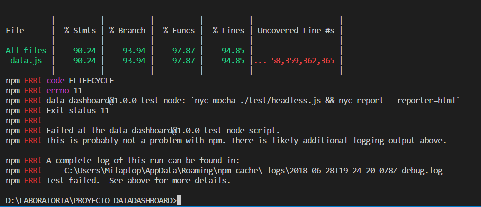
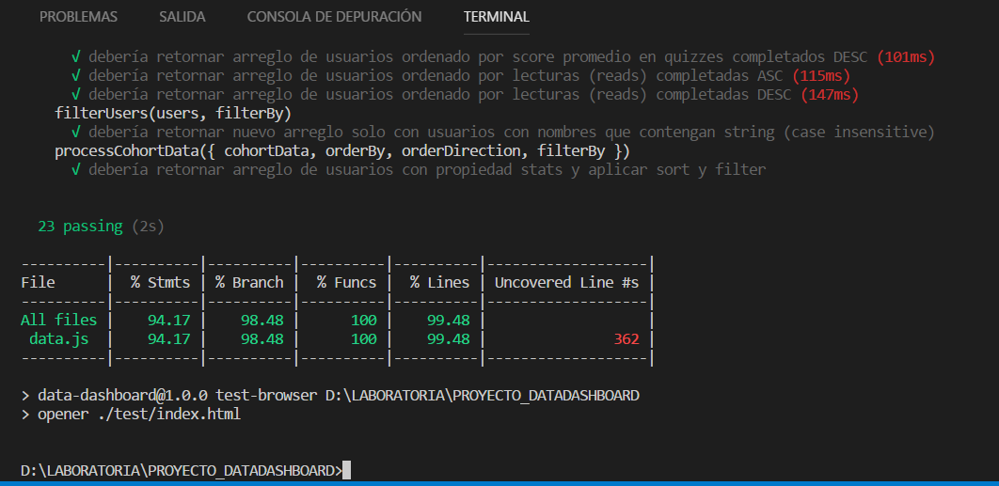
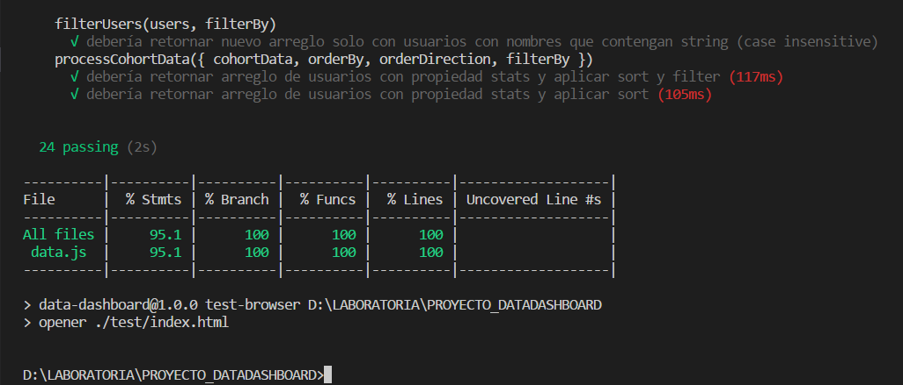

# Data Dashboard

## Producto
**Data dashboard** (_tablero de visualización de datos_) 📉. Actualmente esta interfaz permite a las TMs _ver_ y _usar_ la data de progreso del LMS.

## Preámbulo

>En Laboratoria, las Training Managers (TMs) hacen un gran trabajo al analizar la mayor cantidad de datos posibles respecto al progreso de las estudiantes para apoyarlas en su aprendizaje. 
La principal medida de progreso de una estudiante en Laboratoria es su avance completando los proyectos de la [Ruta de Aprendizaje] (https://docs.google.com/spreadsheets/d/1AoXQjZnZ5MTPwJPNEGDyvn5vksiOUoPr932TjAldTE4/edit#gid=536983970) y su desempeño en función a la [Rúbrica de Niveles Esperados](https://docs.google.com/spreadsheets/d/e/2PACX-1vSkQy1waRpQ-16sn7VogiDTy-Fz5e7OSZSYUCiHC_bkLAKYewr4L8pWJ_BG210PeULe-TjLScNQQT_x/pubhtml). Sin embargo, para completar estos proyectos las estudiantes acceden a contenidos de aprendizaje (lecturas, videos, ejercicios y quizzes) en un sistema que llamamos LMS (Learning Management System).El LMS acumula data sobre quién leyó qué, qué ejercicios se han completado, los resultados de los quizzes, etc. A pesar de que la data de progreso del LMS (ej. lecturas leídas, ejercicios completados, nota en quizzes, etc.) no impacta directamente en la evaluación de una estudiante, sí es una pieza de información relevante que las TMs quisieran visualizar para tener un mejor entendimiento de cómo va cada estudiante en su proceso de aprendizaje.

## Sprint Planing

De acuerdo a lo planificado para este proyecto, visualizamos nuestro tablero de tareas para terminar este proyecto.

Dado este proyecto nos enfocamos directamente en la necesidad del usuario, que actualmente son las Training Managers (TMs) de Laboratoria.
Acceder a la necesidad del acceso a informacion de forma rapida y consisa de datos por cada estudiante de Laboratoria, ver el proceso de su avance por cada alumna sobre un cohort determinado ya seleccionado.
De acuerdo a los requerimientos presentados realizamos nuestro primer sketch(prototipo de baja fidelidad ✏️).

### Procedimiento :
Una vez teniendo este sketch 
1. Se procedio a realizar entrevistas
2. Solicitamos feedback de parte del equipo de Laboratoria.

Donde obtuvimos la siguiente informacion:

* Donde los principales usuarios son: Training Managers de Laboratoria.

* El objetivo principal en relacion al producto:

  + Es el de acceder a datos globales para poder ver el rendimiento de cada alumna de Laboratoria de diferentes sedes.

* La informacion mas importante a visualizarse en la interfaz :

  + Datos globales de las promociones anteriores y actuales Cohorts 🎓.
  + Progreso de cada Alumna en base a lecturas, examenes, ejercicios por promocion.

* Acceso a datos:
  + Se accede a estos datos a finales de cada proyecto presentado por las alumnas de Laboratoria.

Por ultimo nos acercamos a las usuarias directas Training Managers (TMs), para pulir detalles, donde presentamos el sketch de baja fidelidad, para hacer el testeo a las usuarias, nos indicaron detalles a reforzar.
De acuerdo al primer feedback realizamos  la Interfaz de Usuario.

De acuerdo al feedback constante por parte del equipo de Laboratoria y de las Training Managers (TMs), procedimos a diseñar la interfaz de acuerdo a los requerimientos del usuario a travez de la herramienta Figma 💻.

(https://www.figma.com/proto/GYXuswMezoQFWHYrCFyAGSLJ/DATA-DASHBOARD?scaling=min-zoom&node-id=27%3A3)

Exactamente se visualiza todo el flujo del proyecto, donde se puede seleccionar un cohort de una lista de cohorts, a partir de ello se visualiza datos generales de las estudiantes de como van en todo el proceso de aprendizaje durante el Bootcamp sobre cada cohort y con mas a detalle al ingresar a visualizar informacion por cada alumna.
Optamos por hacer uso de solo tres colores en toda la interfaz.

### Implementación de la Interfaz de Usuario (HTML/CSS/JS)

Actualmente nuestra Interfaz de usuario nos permite:

1. Permitir al usuario seleccionar un cohort de una lista de cohorts.
2. Al seleccionar un cohort:
   - Listar las estudiantes de ese cohort
   - Para cada estudiante:
     + Calcular porcentaje de completitud de todos los _cursos_.
     + Calcular grado de completitud de _lecturas_, _ejercicios autocorregidos_,
       y _quizzes_.
   - Ordenar estudiantes por completitud _general_ (porcentaje consumido/completado
     de todos los cursos del cohort en cuestión), de _lecturas_, _ejercicios
     autocorregidos_ y _quizzes_.
   - Filtrar/buscar estudiantes por nombre.
3. Visualizarse a travez de distintos tamaños de pantallas: móviles,
   tablets y desktops (responsive);

## Test

Una parte importante para verificar y corroborarr todo nuestro codigo, procedimos a acceder a ejecutar los test de la siguiente manera:

### Test 1

Ejecutamos la Primera funcion.
  >computeUsersStats(users, progress, courses) 
  - √ debería retornar arreglo de usuarios con propiedad stats

### Test 2
Ejecutamos la Segunda funcion (sortUsers)
  >sortUsers(users, orderBy, orderDirection)

     - √ debería retornar arreglo de usuarios ordenado por nombre ASC
     - √ debería retornar arreglo de usuarios ordenado por nombre DESC
     - √ debería retornar arreglo de usuarios ordenado por porcentaje general ASC 
     - √ debería retornar arreglo de usuarios ordenado por porcentaje general DESC 
     - √ debería retornar arreglo de usuarios ordenado por ejercicios completados ASC
     - √ debería retornar arreglo de usuarios ordenado por ejercicios completados DESC 
     - √ debería retornar arreglo de usuarios ordenado por quizzes completados ASC 
     - √ debería retornar arreglo de usuarios ordenado por quizzes completados DESC 
     - √ debería retornar arreglo de usuarios ordenado por score promedio en quizzes completados ASC 
     - √ debería retornar arreglo de usuarios ordenado por score promedio en quizzes completados DESC 
     - √ debería retornar arreglo de usuarios ordenado por lecturas (reads) completadas ASC 
     - √ debería retornar arreglo de usuarios ordenado por lecturas (reads) completadas DESC 

### Test 3
Ejecutamos la Tercera funcion (filterUsers)
  >filterUsers(users, filterBy) 
  
     - √ debería retornar nuevo arreglo solo con usuarios con nombres que contengan string 

### Test Final
Ejecutamos la ultima funcion (processCohortData)
  > processCohortData({ cohortData, orderBy, orderDirection, filterBy })

     - √ debería retornar arreglo de usuarios con propiedad stats y aplicar sort y filter
     - √ debería retornar arreglo de usuarios con propiedad stats y aplicar sort

## Herramientas utilizadas

* HTML
* CSS
* JAVASCRIPT ES6
* FIGMA
* GIT BASH
* FIGMA
